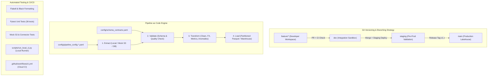

# CI/CD and Version Control for Data Engineering Pipelines

[](https://github.com/organization/data-pipeline/actions)
[](https://pytest.org)
[](https://python.org)
[](https://github.com/psf/black)

A production-grade, enterprise Data Engineering pipeline demonstrating **Code Versioning**, **Pipeline as Code**, and **Continuous Integration / Continuous Deployment (CI/CD)** with automated unit testing, mock testing, and schema contracts.

---

## Architecture Overview



---

## Key Modules & Features

### 1. Code Versioning & Branching Strategy
- Complete documentation in [`docs/BRANCHING_STRATEGY.md`](docs/BRANCHING_STRATEGY.md).
- Tailored for data engineering teams with **Expand-and-Contract schema migrations**, **Data contract versioning**, **Isolated historical backfills**, and environment isolation (`dev`, `staging`, `main`).

### 2. Pipeline as Code & Declarative Configuration
- Environment-specific configs: [`config/pipeline_config.dev.yaml`](config/pipeline_config.dev.yaml) & [`config/pipeline_config.prod.yaml`](config/pipeline_config.prod.yaml).
- Declarative data schema contracts: [`config/schema_contracts.yaml`](config/schema_contracts.yaml).
- Documentation in [`docs/PIPELINE_AS_CODE.md`](docs/PIPELINE_AS_CODE.md).

### 3. Automated Testing Suite (CI/CD)
- **Unit Testing Pure Transformations**: [`tests/test_transformations.py`](tests/test_transformations.py) (FX conversions, temporal partitioning, loyalty tier classification, customer aggregations, Z-score anomaly detection, deduplication).
- **Data Quality & Contract Tests**: [`tests/test_validation.py`](tests/test_validation.py) (Null checks, regex pattern matches, uniqueness, range boundaries).
- **Mock Testing External Storage**: [`tests/test_pipeline_mocks.py`](tests/test_pipeline_mocks.py) (Mock S3 storage, error recovery, JSON format variations).
- Testing guide in [`docs/CI_CD_DATA_GUIDE.md`](docs/CI_CD_DATA_GUIDE.md).

### 4. CI/CD Workflows & Local CI Runner
- **GitHub Actions Workflow**: [`.github/workflows/ci.yml`](.github/workflows/ci.yml) and [`.github/workflows/cd.yml`](.github/workflows/cd.yml).
- **Local CI Runner Script**: [`scripts/run_local_ci.py`](scripts/run_local_ci.py) executes linting, formatting, 36 unit/mock tests, coverage calculation, and pipeline dry run directly in the terminal.

---

## Quickstart & Execution Guide

### 1. Setup Environment
```bash
# Create and activate virtual environment
python -m venv .venv
# On Windows PowerShell:
.\.venv\Scripts\Activate.ps1
# On macOS / Linux:
source .venv/bin/activate

# Install dependencies
pip install -r requirements-dev.txt
```

### 2. Run the Local CI Runner (All CI Checks)
```bash
python scripts/run_local_ci.py
```

### 3. Run Pytest with Code Coverage
```bash
pytest -v --cov=src/pipeline --cov-report=term-missing
```

### 4. Execute the Data Pipeline
```bash
# Development mode
python scripts/run_pipeline.py --env dev

# Production mode
python scripts/run_pipeline.py --env prod
```

---

## Directory Structure

```
.
├── .github/
│   └── workflows/
│       ├── ci.yml                     # GitHub Actions CI workflow
│       └── cd.yml                     # GitHub Actions CD workflow
├── config/
│   ├── pipeline_config.dev.yaml       # Development configuration
│   ├── pipeline_config.prod.yaml      # Production configuration
│   └── schema_contracts.yaml          # Data schema contracts & rules
├── data/
│   ├── raw/
│   │   └── customer_transactions.json # Sample raw transactions
│   └── output/                        # Transformed output destination
├── docs/
│   ├── BRANCHING_STRATEGY.md          # Git branching strategy for data teams
│   ├── PIPELINE_AS_CODE.md            # Pipeline as code documentation
│   └── CI_CD_DATA_GUIDE.md            # Testing & mocking guide
├── scripts/
│   ├── run_local_ci.py                # Local CI test runner CLI
│   └── run_pipeline.py                # Pipeline execution CLI
├── src/
│   └── pipeline/
│       ├── __init__.py
│       ├── config.py                  # Pydantic configuration parser
│       ├── extract.py                 # Extractor with mock storage client
│       ├── transform.py               # Pure transformation functions
│       ├── validate.py                # Schema contract validator
│       ├── load.py                    # Target loader
│       └── runner.py                  # Pipeline orchestrator
├── tests/
│   ├── __init__.py
│   ├── conftest.py                    # Shared pytest fixtures & mocks
│   ├── test_config.py                 # Configuration loader tests
│   ├── test_pipeline_mocks.py         # Mock storage & connector tests
│   ├── test_transformations.py        # Transformation unit tests
│   └── test_validation.py             # Schema contract tests
├── .gitignore
├── requirements.txt
├── requirements-dev.txt
└── README.md
```
