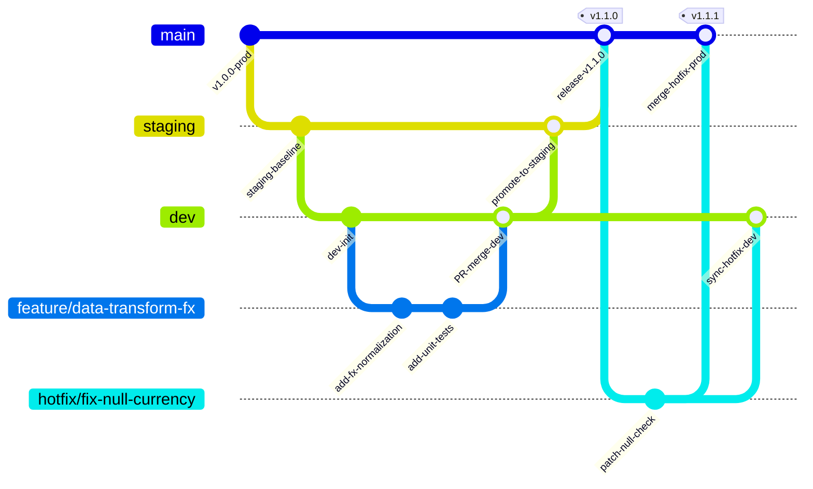

# Git Branching Strategies Tailored for Data Engineering Teams

In traditional software development, Git branching deals predominantly with stateless application logic. In **Data Engineering**, pipelines interact with persistent state, evolving data schemas, large distributed storage systems (Lakehouses, Warehouses, S3, GCS), and upstream/downstream data contracts.

This guide outlines Git branching strategies tailored specifically to the unique constraints of data teams.

---

## 1. Branching Topology Overview

We adopt a **Data-Adapted Trunk/Gitflow Hybrid Strategy**:

---

## 2. Branch Hierarchy & Environment Isolation

| Branch Name | Associated Data Environment | Purpose & Permissions | Automated CI/CD Actions |
| :--- | :--- | :--- | :--- |
| `main` | **Production Data Lakehouse / Warehouse** | Production-ready pipeline code. Protected branch; direct pushes prohibited. Requires 2 peer reviews + passing CI. | CD triggers deployment to production Airflow/Prefect/dbt orchestrators. |
| `staging` | **Pre-Production / Anonymized Staging Data** | Integration testing against realistic data samples and end-to-end orchestration tests. | Deploys to staging cluster; runs regression suite on sampled production data. |
| `dev` | **Development Data Sandbox** | Active team integration branch. Aggregates features prior to staging release. | Executes linting, full unit tests, mock tests, and schema contract validation. |
| `feature/*` | **Local / Developer Isolated Sandbox** | Individual feature development (e.g. `feature/loyalty-tier-calc`). Created from `dev`. | Executes local CI runner (`scripts/run_local_ci.py`) and PR validation checks. |
| `hotfix/*` | **Production Patch Sandbox** | Urgent production pipeline fixes. Branched directly from `main` and merged to both `main` and `dev`. | Executes full regression tests and emergency deployment. |
| `backfill/*` | **Historical Re-run Sandbox** | Dedicated branch for executing one-off historical data backfills or schema migrations. | Isolated pipeline runs targeting specific partition date ranges. |

---

## 3. Critical Data Engineering Considerations

### A. Stateless Code vs Stateful Data (Schema Migrations)
When database schemas or table definitions change:
1. **Never make breaking schema modifications in a single commit.**
2. Use the **Expand-and-Contract (Parallel Run) Pattern**:
   - *Phase 1 (Expand)*: Add new column or table in a feature branch without removing old fields. Pipeline writes to both old and new structures.
   - *Phase 2 (Migrate)*: Update downstream consumers and backfill historical data.
   - *Phase 3 (Contract)*: Remove legacy columns after verifying all consumers have migrated.

### B. Data Contract Versioning
Data schemas are codified in `config/schema_contracts.yaml`.
- Schema changes adhere to Semantic Versioning (`MAJOR.MINOR.PATCH`):
  - **PATCH**: Non-breaking updates (e.g., adding description metadata).
  - **MINOR**: Backward-compatible additive changes (e.g., adding an optional nullable field).
  - **MAJOR**: Breaking changes (e.g., dropping a required field, changing type from string to int).
- Pull Request CI automatically runs contract diff checks against existing production contracts.

### C. Isolated Backfills with Git Tags
For historical re-processing:
1. Tag the exact commit used for the backfill: `git tag backfill-2026-Q1-v1.0.0`.
2. Document backfill parameters (`start_date`, `end_date`, `batch_size`) in the commit message or an environment manifest.

---

## 4. Pull Request (PR) Quality Gate Checklist

Every PR submitted by data engineers must satisfy the following criteria:

- [ ] **Pure Transformation Unit Tests**: All business transformation logic has unit tests with 100% boundary condition coverage.
- [ ] **Data Contract Verification**: `schema_contracts.yaml` updated if schema changed.
- [ ] **External Dependency Mocking**: Cloud storage (S3/GCS) and database calls are mocked in tests.
- [ ] **Local CI Runner Execution**: `python scripts/run_local_ci.py` passed with 0 errors.
- [ ] **Idempotency Checked**: Transformations produce identical output if re-executed on the same input dataset.
- [ ] **Data Partitioning Verified**: Output tables properly partitioned by year/month/date.
