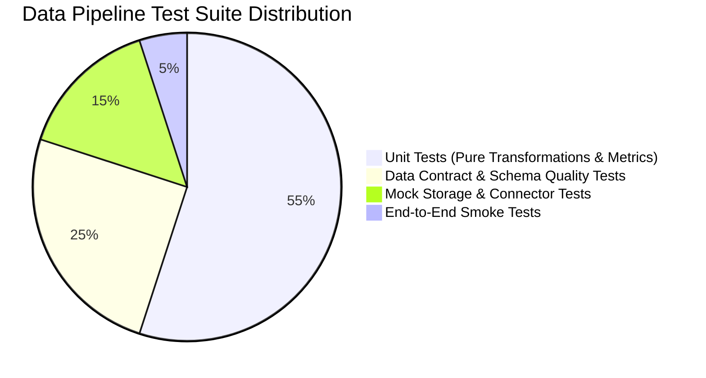

# CI/CD for Data Pipelines: Automated Testing & Mocking Guide

Continuous Integration (CI) and Continuous Deployment (CD) for data engineering ensures that pipeline bugs, schema breakages, and corrupt data transformations are caught **before** they reach production lakehouses and business dashboards.

---

## 1. The Data Engineering Testing Pyramid



### Layer 1: Pure Transformation Unit Tests (Fastest & Highest Volume)
- **Target**: Isolated functions in `src/pipeline/transform.py`.
- **Technique**: Pass in synthetic `pandas.DataFrame` fixtures, assert output columns, values, and edge cases (e.g. negative numbers, missing values, extreme boundary thresholds).
- **Execution Speed**: Milliseconds.

### Layer 2: Data Contract & Schema Quality Tests
- **Target**: Validation rules in `src/pipeline/validate.py` against `config/schema_contracts.yaml`.
- **Technique**: Test non-nullable fields, uniqueness constraints, categorical enums, numeric bounds, and regex format compliance.

### Layer 3: Mock Testing for External Dependencies
- **Target**: Cloud storage (S3/GCS buckets), database query connectors, REST APIs.
- **Technique**: Use dependency injection (`StorageClientInterface`) and `pytest-mock` / `unittest.mock` to simulate cloud responses without hitting real AWS/GCP resources.

### Layer 4: End-to-End Pipeline Dry Run
- **Target**: Full extraction -> validation -> transformation -> validation -> load sequence using `scripts/run_pipeline.py`.

---

## 2. Mocking Strategies in Data Pipelines

### Example: Mocking Cloud Storage (S3 / Blob)
Instead of hardcoding `boto3` calls directly inside business logic, define an abstract interface:

```python
class StorageClientInterface(ABC):
    @abstractmethod
    def read_file(self, uri: str) -> str: pass
    @abstractmethod
    def write_file(self, uri: str, data: str) -> bool: pass
```

In test suites (`tests/test_pipeline_mocks.py`), inject an in-memory `MockS3Client`:

```python
def test_extract_from_mock_s3():
    mock_s3 = MockS3Client({"s3://bucket/data.json": '[{"id": 1, "amount": 100.0}]'})
    df = extract_data(ExtractConfig(source_type="s3", raw_data_path="s3://bucket/data.json"), storage_client=mock_s3)
    assert len(df) == 1
```

---

## 3. Automated Local CI Runner vs Remote GitHub Actions

| Feature | Local CI Runner (`scripts/run_local_ci.py`) | Remote GitHub Actions (`.github/workflows/ci.yml`) |
| :--- | :--- | :--- |
| **Execution Trigger** | Developer executes before committing / pushing | Automatically on `git push` and `pull_request` |
| **Feedback Loop** | Instant (under 2 seconds) | 1–3 minutes in cloud runner |
| **Network Requirement** | Works completely offline | Requires GitHub connectivity |
| **Gating** | Developer self-check | Branch protection gate preventing broken merges |
| **Steps Executed** | Flake8, Black, Pytest, Coverage, Dry Run | Flake8, Black, Pytest, XML Coverage Upload, Staging Deploy |
