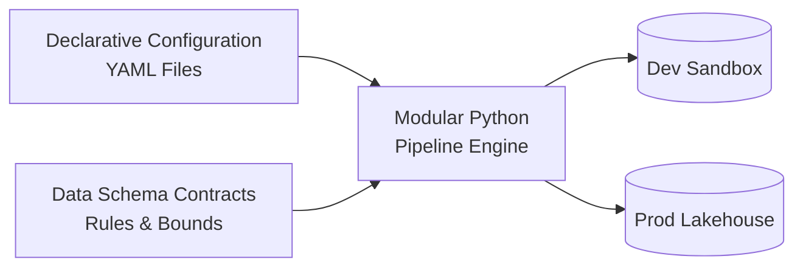

# Pipeline as Code: Managing Infrastructure and Configurations Programmatically

**Pipeline as Code** is the practice of defining, versioning, testing, and managing data processing workflows, configurations, and storage infrastructure using software engineering best practices.

---

## 1. Principles of Pipeline as Code



1. **Declarative Configuration**: All operational parameters (batch size, currency exchange rates, anomaly thresholds, storage paths) reside in structured YAML configuration files (`config/pipeline_config.*.yaml`) rather than hardcoded in application logic.
2. **Environment Portability**: Code behaves identically in Local, Dev, Staging, and Prod environments; only the configuration file and injected credentials vary.
3. **Modular and Testable Components**: Every ETL stage (Extract, Validate, Transform, Load) is an isolated module that accepts parameters and returns immutable data structures.
4. **Data Contracts as Code**: Data expectations (nullability, ranges, allowed values, regex formats) are defined declaratively in `config/schema_contracts.yaml`.

---

## 2. Configuration Management Structure

### Environment Isolation Example

- **Development (`config/pipeline_config.dev.yaml`)**:
  ```yaml
  environment: dev
  extract:
    source_type: "local"
    raw_data_path: "data/raw/customer_transactions.json"
  validation:
    strict_mode: false
    max_error_percentage: 10.0
  load:
    output_path: "data/output/dev_analytics_orders.parquet"
  ```

- **Production (`config/pipeline_config.prod.yaml`)**:
  ```yaml
  environment: prod
  extract:
    source_type: "s3"
    raw_data_path: "s3://prod-lakehouse-raw/transactions/latest/"
  validation:
    strict_mode: true
    max_error_percentage: 0.0
  load:
    output_path: "s3://prod-analytics-lakehouse/curated/customer_orders/"
  ```

---

## 3. Benefits in Modern Data Platforms

- **Reproducibility**: Any data pipeline run can be reproduced by checking out the exact Git commit and using its corresponding config.
- **Auditability**: Git history provides a complete audit trail of who changed transformation formulas, exchange rates, or validation thresholds.
- **Automated Promotion**: Configurations are verified automatically during CI/CD before deployment to production.
